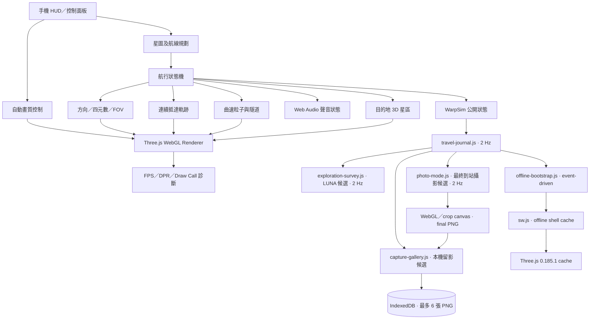

# 技術架構

## 1. 架構結論

V4.0 穩定基線採用**單頁、無後端、無建置流程**的靜態 WebGL 架構。Active evolution 仍維持純靜態部署；核心航行、3D、音效及效能邏輯留在 `index.html`，而低頻率、非渲染關鍵路徑的旅行日誌以 `travel-journal.js` 獨立載入。這個 client bootstrap 目前再動態載入多個 bounded 候選 module，包括 LUNA guided survey 的 `exploration-survey.js`、所有最終目的地可用的 `photo-mode.js`、本機留影庫 `capture-gallery.js`，以及 V4.1 離線恢復候選 `offline-bootstrap.js`。Three.js 仍以固定版本從 CDN 載入，但 Service Worker `sw.js` 會在一次成功在線啟動後保存 active shell 與固定 Three.js `0.185.1`，供後續斷網 reload 回退。

這個做法適合目前階段：

- 打開即用，容易放到 GitHub Pages、Cloudflare Pages、Vercel 或一般靜態空間
- 沒有伺服器端資料庫、API key、伺服器或帳戶維護；候選留影只使用瀏覽器本機 IndexedDB
- 可完整保存為單一 HTML 穩定版本
- 對手機載入及除錯比大型框架簡單
- 候選探索／留影／恢復功能可在不改核心 60 Hz render loop 的情況下獨立驗證
- 在線時核心檔案仍以 network-first 取得最新部署；離線時才使用最近成功快取

代價是主程式已變成單一大型檔案，而 `travel-journal.js` 暫時兼任候選 client bootstrap。下一次架構整理應只做**等效模組化**，不可同時改動航行行為。離線候選亦只提供「online-first」快取，不等於完整 PWA 安裝或真正首次離線啟動。

## 2. 執行時組成



## 3. 主要邏輯區塊

| 區塊 | 責任 |
|---|---|
| 星區資料 `N` | 站點 ID、名稱、3D 座標、類型、描述及環境聲參數 |
| 航線圖 `G` | 以 6.0 LY 為最大單段距離，自動建立無向邊 |
| `plan()` | Dijkstra 最短總距離路線 |
| `navDir()`／`bearing()` | 將星圖座標轉為 Three.js 方向、方位角及高度角 |
| 航行狀態機 | 控制轉向、加速、曲速、抵達及觀景 |
| `arrivalDepthAt()` | 以 Hermite 曲線維持位置與速度連續的抵達軌跡 |
| `buildSystem()` | 按目的地建立星體、星環、星雲、設施與粒子 |
| 程序化材質 | 在 Canvas 生成地球、月球、氣態、冰質、岩質及熔岩表面 |
| `SpaceAudio` | 以 Web Audio 合成引擎、曲速、提示及環境聲 |
| 自動畫質 | 量度移動平均幀時間，調整 DPR 及 GPU 負載 |
| `WarpSim` | 提供測試／診斷用的公開控制介面 |
| `travel-journal.js` | 以 2 Hz 讀取公開 flight state，只在完整抵達最終目的地時把最近旅程寫入本機日誌；同時暫作候選 client bootstrap，不參與每幀渲染 |
| `exploration-survey.js` | V5 候選；只在 LUNA 最終探索顯示三個觀測點，三點完成後解鎖一個本機發現紀錄；只讀公開 state、不改核心相機／航行狀態、不發網絡請求 |
| `photo-mode.js` | V5 候選；只在安全的最終探索提供乾淨觀景與高畫質 PNG capture。以 CSS 隱藏 HUD，不改 camera／flight authority；短暫使用既有 High renderer tier 後輸出 final PNG，並保留原有本機下載流程 |
| `capture-gallery.js` | V5 候選；觀察 Photo Mode 已產生的同一個 final PNG blob，不建立第二次 screenshot／renderer；以專用 IndexedDB `stellar-wrap-capture-gallery` 本機保存最多最近 6 張 PNG 與最少顯示 metadata，提供 Gallery thumbnail／再次儲存／刪除，零網絡／後端 authority |
| `offline-bootstrap.js` | V4.1 候選；註冊 Service Worker、顯示離線準備狀態，以及在 3D module 長時間未 ready 時把 loading 畫面轉為可操作的恢復提示；事件驅動，沒有 render-loop polling |
| `sw.js` | 只處理 active shell 與固定 Three.js 的 offline cache。導航／同源 runtime 為 network-first，固定 Three.js 為 cache-first，並可回報核心快取是否完整；Capture Gallery module 只作靜態 shell 資源快取，不把使用者圖片寫入 Cache Storage |

## 4. 座標及方向模型

### 4.1 星圖座標

每個星區使用：

```text
[X, Y, Z]，單位為模擬光年 LY
```

- `X`：星圖左右
- `Y`：星圖前後／方位計算主軸
- `Z`：高度

### 4.2 Three.js 場景座標映射

Three.js 相機預設向 `-Z` 觀看，所以航行方向使用：

```js
new THREE.Vector3(dx, dz, -dy).normalize()
```

即：

| 星圖 | Three.js |
|---|---|
| `+X` | `+X` |
| `+Y` | `-Z` |
| `+Z` | `+Y` |

方位顯示：

```text
AZ = atan2(dx, dy)
EL = atan2(dz, hypot(dx, dy))
```

這個映射是星圖、HUD 航向及畫面轉向一致的基礎，不可在未同步更新全部相關函式下修改。

## 5. 轉向模型

1. 由目前站與下一站座標計算單位方向向量。
2. 建立目標觀看四元數。
3. 計算目前與目標四元數夾角。
4. 轉向時間按夾角調整：

```text
clamp(1.35 + angleRadians × 0.92, 1.35, 4.10) 秒
```

5. 使用四元數平滑插值，避免 Euler 角跳轉與萬向節鎖。
6. 由方向向量叉積判斷左右轉，加入輕微艦身傾側。
7. 多段航行每到中途站均重新計算，不沿用上一段假方向。

## 6. 抵達模型

曲速脫離、減速及接近目的地共享同一條連續時間軸：

```text
warpExit 1.15 s + decelerate 1.75 s + approach 2.80 s
```

`arrivalDepthAt()` 使用分段 Hermite 曲線，同時指定各交界的位置與速度。設計目的：

- 曲速脫離後仍然持續向前
- 減速後保持低速接近，而不是完全停下
- 最後 0.75 秒才由低速煞停至目的地觀景點
- 階段提示可改變，但物理位置與速度不可重設

詳細數據見 [FLIGHT_MODEL.md](FLIGHT_MODEL.md)。

## 7. 3D 星區生成

### 7.1 共用資源

為降低 GPU 記憶體與 Draw Call：

- 共用球體 geometry
- 共用發光 sprite texture
- 星體材質按類型重用程序化 texture
- 大量星星及曲速線使用 `BufferGeometry`
- 曲速隧道使用 instancing
- 不使用即時陰影

### 7.2 地球

地球由瀏覽器程序化生成多張貼圖：

- 顏色／海陸分布
- 高度／凹凸
- 粗糙度
- 半透明雲層
- 城市夜光

另有獨立大氣 shader 及外圍 glow。海陸並非真實地理數據，而是視覺上仿真的程序化行星。

### 7.3 場景方向

目的地系統先按上一段航行方向對齊，再沿連續深度軌跡移近。中途站飛掠後，星體保留於來向，轉向下一站時自然掠出視野。

## 8. 聲音架構

`SpaceAudio` 只在使用者首次互動後建立 `AudioContext`，符合手機瀏覽器自動播放限制。聲音由 oscillator、filter、gain、panner 及合成提示音組成，沒有外部音訊檔案。

輸入狀態：

- 曲速強度
- 轉向強度及 bank
- 航行階段
- 目前星區 ambient 設定
- 使用者音量／靜音

## 9. 儲存、快取及私隱

Active evolution 使用兩種**純本機**持久化，兩者都不會傳送到網絡：

- `localStorage`：保存畫質模式、聲音設定、旅行日誌及各探索候選的細小狀態。旅行日誌只保留最近最多 12 次已完成路線；中止航程不記錄。
- IndexedDB：Capture Gallery 使用專用資料庫 `stellar-wrap-capture-gallery`，只保存 Photo Mode 已成功產生的同一個 PNG blob、目的地、時間、像素尺寸及 frame format；最多保留最近 6 張，新增第 7 張時在同一 read/write transaction 刪除最舊記錄。

私隱及 authority 邊界：

- 沒有後端、帳戶、遙測或分析追蹤。
- LUNA guided survey 只保存三個固定觀測點的完成 ID；三點完成狀態代表一個本機發現紀錄。
- Photo Mode 仍擁有唯一 capture／download 流程；Capture Gallery 只旁接其 final PNG blob，不建立第二次 screenshot、第二個 renderer 或第二套 camera authority。
- Gallery 的 thumbnail 使用短生命週期 object URL，重新 render／離頁時會 revoke；「再次儲存」同樣只從本機 blob 產生下載。
- IndexedDB 不複製 Travel Journal、Star Atlas、航線或飛行 authority；留影寫入失敗／quota failure 不得阻塞既有 PNG 下載。
- 沒有上傳圖片、位置、裝置、航行或探索資料。
- 沒有 API key 或秘密。

Service Worker cache 只保存公開靜態程式碼與固定 Three.js 依賴，不保存使用者圖片或其他使用者資料。第一次使用仍需在線；其後離線 reload 只回退到最近成功快取。Capture Gallery 的詳細資料合約見 [CAPTURE_GALLERY.md](CAPTURE_GALLERY.md)，離線策略及驗收見 [OFFLINE.md](OFFLINE.md)。

## 10. 已知技術債

1. `index.html` 為單一大型檔案，修改衝突風險逐步增加。
2. Three.js 首次載入仍依賴外部 CDN；現時只在一次成功 online load 後提供離線快取，尚未 vendor 入 repo。
3. 缺乏 GPU 畫面差異測試，視覺回歸仍需人手。
4. 星區資料、場景建構及 UI 文案未分層。
5. 目的地座標屬產品模擬尺度，不是實際天文距離。
6. 程序化地球是視覺仿真，不是地理準確模型。
7. `travel-journal.js` 暫時兼任多個候選 client module 的載入入口；若這些方向獲批准，應改成明確的 client bootstrap，而不是繼續增加隱性相依。
8. `canvas.toBlob()` 在 `preserveDrawingBuffer:false` 的 WebGL renderer 上依賴 capture callback 緊接新 render frame；真 production Chromium 已有自動 capture evidence，但 iPhone Safari 的實際 PNG、下載及 IndexedDB quota 行為仍應作補充實機確認。
9. Service Worker／Cache Storage 與 IndexedDB 在 iOS Safari 的資料保留可能受系統儲存政策影響；不能把一次 desktop/browser-profile persistence test 當作手機長期保留保證。

## 11. 建議模組化次序

在不改變行為前提下，逐步拆成：

```text
src/
├── data/star-systems.js
├── navigation/route-planner.js
├── navigation/coordinates.js
├── flight/state-machine.js
├── flight/arrival-profile.js
├── scenes/system-builder.js
├── effects/warp.js
├── audio/space-audio.js
├── performance/quality-controller.js
└── ui/controller.js
```

每次只拆一個邏輯區塊，先加入等效測試，再移動程式碼；`releases/v4.0-stable.html` 永遠不修改。
