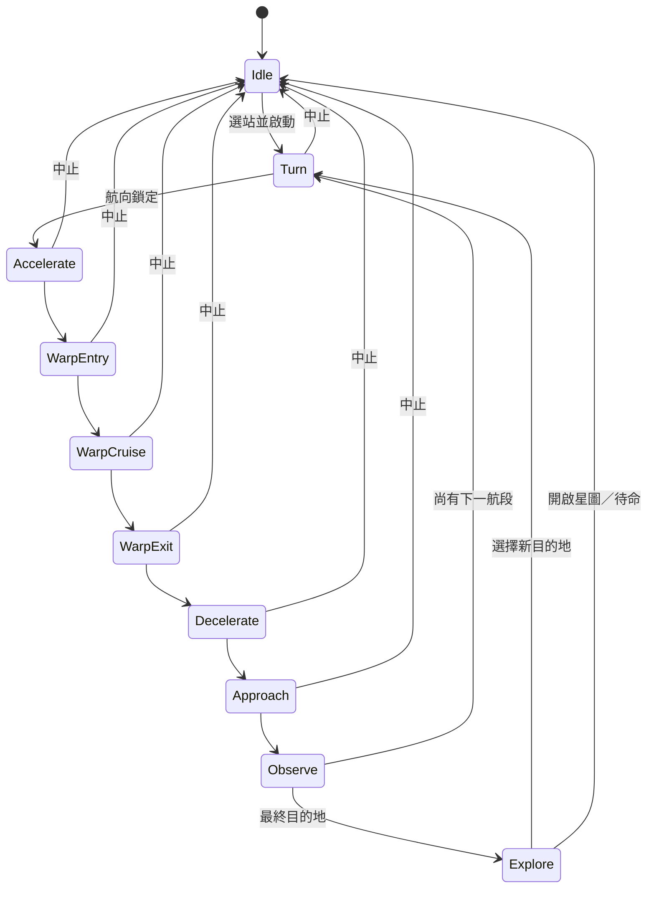

# 航行模型與狀態機

## 1. 完整流程



## 2. 階段時間

| 階段 | 時間模型 | 主要視覺／動作 |
|---|---:|---|
| `turn` | `clamp(1.35 + angle × 0.92, 1.35, 4.10)` | 四元數轉向、艦身傾側、航向 HUD |
| `accelerate` | 2.35 s | 星線開始伸長、FOV 微增、速度升至亞光速 |
| `warpEntry` | 1.05 s | 爆發光暈、閃光、曲速隧道建立 |
| `warp` | `(1.8 + distance × 0.78) / multiplier` | 高速星線、隧道巡航、背景向下一站過渡 |
| `warpExit` | 1.15 s | 曲速線收束、目的地低透明度出現 |
| `decelerate` | 1.75 s | 連續減速，目的地持續接近 |
| `approach` | 2.80 s | 先低速定速前進，最後 0.75 s 煞停 |
| `observe` | 中途 2.5 s／最終 3.0 s | 中途飛掠或最終近距觀景 |

航行面板的預計時間另加入約 2.2 秒轉向預算，作快速估算。實際大幅轉向會按夾角延長至最多 4.1 秒。

## 3. 距離與航行時間

單段距離：

```text
d = √((ΔX)² + (ΔY)² + (ΔZ)²)
```

曲速巡航時間：

```text
warpSeconds = (1.8 + d × 0.78) / warpMultiplier
```

其中：

- `d`：該航段距離，單位為模擬 LY
- `warpMultiplier`：使用者設定，範圍 0.7× 至 1.8×

固定進入／脫離／接近時間保留電影式節奏；距離差異主要由曲速巡航時間表達。

## 4. 方向與轉向

每段航行都由星圖座標重新計算方向：

```text
ΔX = target.X - current.X
ΔY = target.Y - current.Y
ΔZ = target.Z - current.Z
```

顯示角度：

```text
AZ = atan2(ΔX, ΔY)
EL = atan2(ΔZ, √(ΔX² + ΔY²))
```

畫面轉向：

1. 將星圖方向映射到 Three.js 相機坐標。
2. 建立目標 quaternion。
3. 以平滑插值由目前 quaternion 轉到目標。
4. 由叉積決定 bank 左右方向。
5. 航行中手動視角輸入逐步回正，避免破壞自動航向。

## 5. 連續抵達軌跡

### 問題基線

早期版本在：

```text
脫離曲速 → 減速 → 接近
```

每階段分別使用獨立 easing，造成減速完成後速度歸零，下一階段再突然前移。

### V3.2 起的解法

三個階段共用 `arrivalClock` 與 `arrivalDepthAt(t)`。軌跡使用分段 cubic Hermite interpolation：

| 時間點 | 深度 | 速度意圖 |
|---|---:|---:|
| 0.00 s | 300 | 高速向前，約 -110 單位／秒 |
| 1.15 s | 210 | 已脫離曲速，約 -65 |
| 2.90 s | 112 | 平滑減速至 -42 |
| 4.90 s | 26 | 保持 -42 定速接近 |
| 5.70 s | 0 | 最後煞停至 0 |

這些數字是場景深度單位，不是物理公里。驗收重點是位置及一階速度在階段交界連續。

## 6. 航段進度

航行 HUD 以 `legLocal` 表達 0–1 進度：

- 加速：0–1.8%
- 進入曲速：1.8–5.5%
- 曲速巡航：5.5–89%
- 脫離／減速／接近：89–100%
- 觀景：100%

整體進度以：

```text
(已完成航段距離 + 本段距離 × legLocal) / 全程距離
```

計算，避免每段長短不同卻平均分配進度。

## 7. 中途站行為

1. 完成本段 approach。
2. 進入 2.5 秒 `observe` 飛掠。
3. 使用者可按「立即繼續」。
4. 更新目前位置與已完成距離。
5. 保留中途星區在來向位置。
6. 計算中途站 → 下一站的新方向。
7. 平滑轉向後才進入下一次 accelerate。

不可在中途站直接把相機瞬移到下一個方向。

## 8. 中止行為

中止應：

- 立即停止自動狀態機
- 清除曲速及隧道強度
- 保留於最近已完成站點，而非虛構航程中間站
- 讓畫面平滑回到可操作待命狀態
- 重新允許選站及拖動觀察

## 9. 修改驗收

凡修改航行時間、方向、相機或抵達曲線，至少驗證：

- `SOL → LUNA` 短直航
- `SOL → ORION` 長多段航程
- `ORION → TAU` 需多次改變方位的航程
- 轉向大於 90° 時沒有跳動
- 每個階段交界沒有位置停頓或速度突變
- 0.7× 及 1.8× 曲速倍率均能完整抵達
