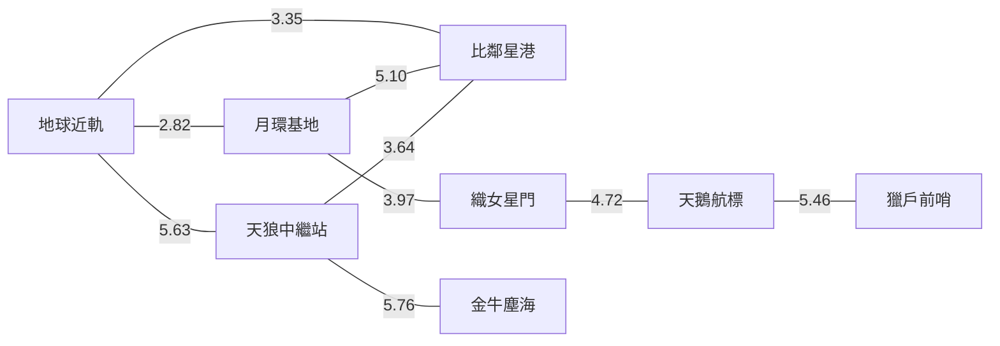

# 星圖、座標及航線網絡

## 1. 模擬尺度

星圖使用產品內部的模擬光年座標，用於方向、段距離及航線規劃。它不是現實天文目錄，站名及景觀採用科幻化設計。

- 單位：模擬 LY
- 最大安全單段距離：6.0 LY
- 邊建立條件：兩站 3D Euclidean 距離不超過 6.0 LY
- 路線目標：總距離最短
- 演算法：Dijkstra

## 2. 八個星區

| ID | 星區 | X | Y | Z | 類型 | 主要景觀 |
|---|---|---:|---:|---:|---|---|
| SOL | 地球近軌 | 0.0 | 0.0 | 0.0 | 類地行星近軌 · G 型主序星系 | 地球、月球、大氣層、城市夜光、近地軌道環 |
| LUNA | 月環基地 | 1.4 | 2.4 | 0.5 | 天然衛星基地 · 地月系 | 近距月面、遠方地球、月球軌道基地 |
| VEGA | 織女星門 | 5.2 | 3.1 | 1.4 | A 型藍白主序星 · 曲速門 | 藍白主星、雙層曲速星門、電離塵霧 |
| CYG | 天鵝航標 | 9.1 | 5.6 | 2.3 | 藍紫雙星 · 航標陣列 | 雙星、立體航標環陣、紫藍星際塵帶 |
| ORION | 獵戶前哨 | 12.2 | 1.2 | 3.2 | 紅超巨星前哨 · 發射星雲 | 赤紅巨星、岩質前哨、獵戶塵埃雲 |
| TAU | 金牛塵海 | 9.5 | -4.0 | 1.7 | 環狀氣態巨行星 · 星際塵海 | 巨型環行星、衛星、粉紫塵海 |
| SIRIUS | 天狼中繼站 | 4.4 | -3.4 | -0.9 | 藍白雙星 · 中繼環站 | 雙星、冰質小行星、發光中繼環站 |
| PROX | 比鄰星港 | 1.5 | -1.8 | -2.4 | 紅矮星 · 熔岩行星港 | 紅矮星、熔岩裂谷、小行星帶、外圍星港 |

## 3. 可直航邊

| 起點 | 終點 | 距離 |
|---|---|---:|
| SOL | LUNA | 2.82 LY |
| SOL | SIRIUS | 5.63 LY |
| SOL | PROX | 3.35 LY |
| LUNA | VEGA | 3.97 LY |
| LUNA | PROX | 5.10 LY |
| VEGA | CYG | 4.72 LY |
| CYG | ORION | 5.46 LY |
| TAU | SIRIUS | 5.76 LY |
| SIRIUS | PROX | 3.64 LY |

## 4. 從 SOL 出發的最短路線

| 目的地 | 自動路線 | 總距離 |
|---|---|---:|
| LUNA | SOL → LUNA | 2.82 LY |
| PROX | SOL → PROX | 3.35 LY |
| SIRIUS | SOL → SIRIUS | 5.63 LY |
| VEGA | SOL → LUNA → VEGA | 6.79 LY |
| TAU | SOL → SIRIUS → TAU | 11.39 LY |
| CYG | SOL → LUNA → VEGA → CYG | 11.51 LY |
| ORION | SOL → LUNA → VEGA → CYG → ORION | 16.97 LY |

## 5. 星圖投影

2.5D 星圖把 3D 座標投影到 SVG：

- `X / Y` 決定主要平面位置
- `Z` 以水平及垂直偏移表達高度
- 每站有一條 stem 連接基準平面與實際投影點
- 飛船圖示按本段 `legLocal` 在兩站座標之間插值
- 航向箭頭指向下一站，而非固定向上

投影只負責介面顯示；實際距離及方向始終使用原始 3D 座標。

## 6. 新增星區規則

新增站點前必須同時確認：

1. 新站在產品世界中的用途與獨特景觀。
2. `X / Y / Z` 座標及與鄰站距離。
3. 航線圖仍然全部互通。
4. 不會意外建立跨越過多節點的 6.0 LY 內捷徑。
5. 從至少三個方向抵達時，場景仍可合理呈現。
6. 手機星圖標籤不重疊。
7. 場景 GPU 負載不高於現有最重星區。
8. 更新本文件、PRD、測試案例及 route validation。

只增加背景顏色而沒有獨特 3D 地標的站點，不應加入正式星圖。
